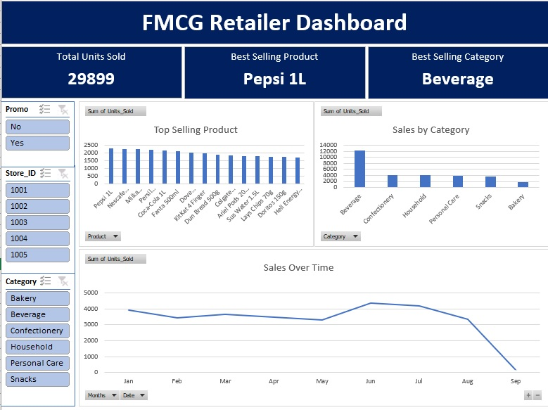

# FMCG Retail Sales Analysis Made Three Ways

Date: September 14, 2025 Author: Vesela Velikova

## **Project Scenario**

The FMCG (Fast-Moving Consumer Goods) retailer dataset is generated via ChatGPT. The dataset contains information about sales data for several stores.
Task: To analyze sales trends over a period of time.
In order to analyze the data, three ways are used:
 1. Data is processed in MS Excel, using Pivot tables and Charts. An Excel Sales Dashboard is created.
 2. The dataset is loaded in MySQL Workbench. After that, the data is analyzed by SQL queries.
 3. The dataset is loaded in Tableau Public. Sales Dashboard is created.

Data constraints: 
- The dataset is generated through generative AI.
- The sales data contains only records through September 2025. Not a full year is analyzed.

### **MS Excel table and Dashboard**

Process: 
- Making **Pivot tables** in order to generate charts and build the Excel Dashboard. We investigate trends by examining Units Sold per Product, Units Sold per Category, Sales Over Time, and the Impact of promotions on sales.

### **Query the Data for Insights**

All the SQL Queries can be found [here]. (./fmcg-retail-sales-dataset-mysql.sql)

### **Tableau Public Dashboard**

The Tableau Public Dashboard can be found [here]. (https://public.tableau.com/views/FMCGRetailerDataset/Dashboard1?:language=en-US&:sid=&:redirect=auth&:display_count=n&:origin=viz_share_link)

## **Key Insights**
 
- The analysis reveals that the product with most sales is **Pepsi 1L** with units sold. 
- The category that best sells is **Beverages** which takes **45% of all sales**.
- Best performing store is with **store_id 1003**.
- June is the month with the most sales.
- If we take in account the **active promotions**, the best performing product is **Nescafe Instant 200g** and the months with most sales shifted to **January** and **July**. **Beverages** are the top sold category regardless of the active promotions.

## **Recommendations**

- Ensure consistent stock availability for Pepsi 1L across all stores, especially in peak sales months.
- Consider bundling Pepsi 1L with complementary snacks (e.g., products that do not sell well) to increase basket size.
- Consider increasing the frequency or extending the duration of promotions for coffee products.
- Since beverages sell regardless of promotions, promotions could be focused on other underperforming categories.
- Considering the best performing months are during the summer period, using targeted marketing campaigns in May should capture early demand.